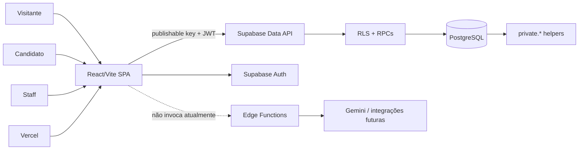

# GDGJobs — Guia completo do projeto

O **GDGJobs** é um MVP paralelo do GDG Lauro de Freitas para estudar e demonstrar um motor de vagas curadas pela comunidade.

O projeto conecta profissionais de tecnologia a oportunidades aprovadas por curadores, mantendo o banco como fonte de verdade para autorização, estados e regras críticas.

> **Status atual:** laboratório em homologação, portfólio e aprendizado. Este repositório não é o produto oficial da comunidade e não está aprovado para operar com PII real.

Este arquivo é o guia público principal. Para executar o projeto, use [`SETUP.md`](SETUP.md); para arquitetura e contratos, use [`PROJECT_OVERVIEW.md`](PROJECT_OVERVIEW.md); para contribuição, use [`CONTRIBUTING.md`](CONTRIBUTING.md).

## Sumário

- [Visão Geral](#visão-geral)
- [Objetivos e roadmap](#objetivos-e-roadmap)
- [Stack](#stack)
- [Funcionalidades](#funcionalidades)
- [Estrutura do Projeto](#estrutura-do-projeto)
- [Arquitetura e fluxo de dados](#arquitetura-e-fluxo-de-dados)
- [Banco de Dados](#banco-de-dados)
- [Estados do domínio](#estados-do-domínio)
- [Configuração e Instalação](#configuração-e-instalação)
- [Variáveis de Ambiente](#variáveis-de-ambiente)
- [Scripts](#scripts)
- [Rotas](#rotas)
- [Perfis e Permissões](#perfis-e-permissões)
- [Painel Admin](#painel-admin)
- [Segurança e Privacidade](#segurança-e-privacidade)
- [IA e integrações futuras](#ia-e-integrações-futuras)
- [Status do que foi desenvolvido](#status-do-que-foi-desenvolvido)
- [Fluxo de contribuição](#fluxo-de-contribuição)

## Visão Geral

O GDGJobs implementa o núcleo:

```text
catálogo aprovado → detalhe da vaga → perfil → candidatura → curadoria
```

O visitante pode navegar pelo catálogo público. O candidato autentica-se com Google, completa o perfil quando necessário e envia candidaturas. A equipe staff cadastra ou ingere vagas como `pending`; curadores e moderadores analisam os itens; somente vagas aprovadas aparecem no catálogo público.

Este repositório não tenta copiar o produto oficial linha a linha. O produto oficial da comunidade é a referência de negócio; este projeto utiliza outra stack, outro ritmo e foco adicional em segurança, privacidade, testes e aprendizado com agentes de IA.

| Projeto | Propósito |
|---|---|
| [GDG Jobs oficial](https://github.com/lfdev-gdg/GDGJobs) | Produto comunitário e fonte de verdade do roadmap oficial |
| Este repositório | MVP paralelo, laboratório técnico e portfólio |

## Objetivos e roadmap

### Objetivos atuais

- Centralizar vagas relevantes para a comunidade GDG.
- Garantir uma fila de curadoria antes da publicação.
- Permitir candidatura com perfil mínimo e regras de privacidade.
- Exercitar RLS, RPCs, observabilidade, acessibilidade e operação segura.
- Manter a arquitetura simples até que métricas justifiquem complexidade adicional.

### Evolução planejada

| Fase | Direção | Situação |
|---|---|---|
| V1 | Catálogo curado, busca, filtros, candidatura e curadoria | Núcleo implementado |
| V2 | Perfil mais completo, filtros e fluxos de personalização | Parcial/backlog |
| V3 | Matching determinístico, embeddings e recomendação | Bloqueado por gates de privacidade e governança |

Matching semântico, Gemini, conectores externos, portal de empresas e operação com PII real não são pré-requisitos do catálogo V1.

## Stack

| Camada | Tecnologia | Responsabilidade |
|---|---|---|
| Frontend | React 19 + Vite 8 | SPA, componentes, rotas e interação |
| Roteamento | React Router 7 | Rotas públicas, candidato e staff |
| Estilos | CSS próprio com tokens em `src/styles.css` | Light/dark, identidade visual, responsividade e acessibilidade |
| Ícones | `lucide-react` | Ícones consistentes na interface |
| Estado | Estado local, hooks e snapshots de autenticação | Estado transitório sem duplicar o banco como store global |
| Dados | Supabase PostgreSQL | Fonte de verdade, constraints, índices e estados |
| API de dados | Supabase Data API/PostgREST | Leitura RLS e chamadas RPC |
| Identidade | Supabase Auth | Google OAuth para candidatos; senha e MFA para staff |
| Autorização | RLS + funções PostgreSQL + RPCs | Enforcement no banco, não apenas na UI |
| Backend complementar | Supabase Edge Functions | Integrações sensíveis e recursos futuros |
| Hospedagem | Vercel Hobby | Build estático em `dist/` e previews |
| Qualidade | ESLint, Vitest, Playwright/axe e GitHub Actions | Lint, testes, build, acessibilidade e gates |
| Gerenciador | pnpm 10.30.1 + Node.js 22 | Instalação e scripts do projeto |

### Decisões que não devem ser alteradas sem aprovação

- Não migrar este MVP para Next.js, Tailwind, shadcn/ui, Firebase ou outro provedor de autenticação.
- Não colocar `service_role`, `sb_secret_*`, senha ou segredo de provedor no bundle do navegador.
- Não usar a UI como autorização.
- Não ativar IA, avatar, e-mail transacional ou PII real sem os gates próprios.

## Funcionalidades

### Visitante

- Portal público com identidade GDGJobs.
- Catálogo de vagas aprovadas.
- Busca textual, filtros, ordenação e paginação.
- Filtros estruturados de país, localidade e faixa salarial, preservados na URL.
- Detalhe público da vaga.
- Páginas de eventos.
- Shell de newsletter, ainda sem envio real por e-mail.
- Tema claro/escuro e layout responsivo.

### Candidato

- Login por Google OAuth.
- Onboarding quando o perfil está incompleto.
- Edição de perfil e avatar quando o fluxo de upload está habilitado no ambiente permitido.
- Preferências e histórico de privacidade.
- Candidatura por vaga.
- Retirada de candidatura quando permitida pelo estado do domínio.
- Página de minhas candidaturas com paginação.
- Estados de carregamento, erro, vazio e retry.

### Staff

- Login por e-mail e senha.
- MFA TOTP na interface quando `VITE_STAFF_MFA_REQUIRED=true`.
- Curadoria com fila, prioridade, rubrica, pareceres e quórum.
- Reenvio de vagas rejeitadas para nova rodada.
- Cadastro e edição de empresas e vagas.
- Publicação administrativa transacional: empresa nova e vaga `pending` na mesma RPC.
- Ingestão manual/fixture em homologação.
- Observabilidade operacional dos fluxos principais via eventos `ops.*` no console local/Preview/homolog.

### Qualidade e operação

- RLS defensivo com cenários negativos para `anon`, candidato, staff AAL1 e staff AAL2.
- Rate limit de candidatura com lock transacional.
- Deduplicação de publicação por empresa e título normalizado.
- Manifesto explícito de migrations de produção.
- Medições de navegação, listas staff e painel administrativo.
- CI para lint, testes, build, bundle e validação do manifesto.

## Estrutura do Projeto

```text
gdg-senai/
├── ABOUT.md                         # Este guia para usuários e desenvolvedores
├── README.md                        # Entrada rápida do repositório
├── PROJECT_OVERVIEW.md              # Arquitetura, decisões e limites técnicos
├── SETUP.md                         # Setup local, ambientes, MFA e operação
├── CONTRIBUTING.md                  # Processo Plan / Executor / PR
├── package.json                     # Scripts e dependências
├── vite.config.js                   # Build, ambiente e release SHA
├── vercel.json                      # Headers e configuração de deploy
├── .github/workflows/ci.yml         # CI de qualidade e RLS homolog
├── public/                          # Marca, favicon, imagens e vídeo do portal
├── src/
│   ├── App.jsx                      # Shell, sessão, gates e rotas
│   ├── features/
│   │   ├── admin/                   # Painel, vagas, dashboard e gates staff
│   │   ├── auth/                    # Login, sessão, perfil, avatar e MFA
│   │   ├── catalog/                 # Catálogo, busca e filtros
│   │   ├── curation/                # Fila, rubrica e pareceres
│   │   ├── events/                  # Eventos públicos
│   │   ├── ingest/                  # Ingestão controlada em homologação
│   │   ├── jobs/                    # Detalhe, candidatura e histórico
│   │   ├── newsletter/              # Shell de newsletter
│   │   ├── portal/                  # Página inicial e CTA contextual
│   │   └── privacy/                 # Consentimento, preferências e auditoria
│   ├── lib/                         # Cliente Supabase, APIs e adaptadores
│   ├── shared/ui/                   # Header, tema, diálogos e componentes comuns
│   ├── styles.css                   # Tokens e estilos globais
│   └── test/                        # Setup e utilitários de teste
├── scripts/
│   ├── check-rls.mjs                # Harness defensivo contra homologação
│   ├── prod-migrations.mjs          # Manifesto e gates de migration
│   └── measure-*.mjs                # Medições de UX/performance
├── supabase/
│   ├── migrations/                  # Apenas cadeia do manifesto de produção
│   ├── migrations/homolog/          # SQL exclusivo de homologação
│   ├── migrations/held/             # Camada B ainda não promovida
│   └── functions/                   # Edge Functions e código compartilhado
├── docs/                            # Documentação versionada do projeto
├── docs-local/                      # Evidências e operação local, ignorado
└── docs-local.example/              # Modelos sem segredos
```

## Arquitetura e fluxo de dados



### Fronteiras

- React renderiza a interface, mantém estado transitório e solicita operações.
- Supabase Auth mantém a sessão e os JWTs.
- PostgreSQL é a fonte de verdade para papéis, estados, constraints e autorização.
- RLS protege tabelas expostas à Data API.
- RPCs encapsulam mudanças sensíveis, quórum, candidatura, rate limit e publicação atômica.
- Edge Functions ficam reservadas para integrações protegidas; a SPA atual não chama matching.

## Banco de Dados

O banco é versionado por migrations. A raiz de `supabase/migrations/` representa a cadeia que pode ser aplicada em produção; SQL de homologação e Camada B ficam em subpastas separadas.

### Entidades principais

| Entidade | Uso |
|---|---|
| `auth.users` | Identidade gerenciada pelo Supabase Auth |
| `public.profiles` | Perfil, papel e dados mínimos do usuário |
| `public.companies` | Empresas relacionadas às vagas |
| `public.jobs` | Vagas, estado, empresa, conteúdo e dados estruturados |
| `public.applications` | Candidaturas e snapshots do perfil no momento da candidatura |
| `public.job_curation_reviews` | Pareceres por rodada de curadoria |
| `public.privacy_purposes` | Catálogo de finalidades de privacidade |
| `public.privacy_consents` | Consentimentos e preferências do titular |
| `public.privacy_audit_events` | Trilha de auditoria de privacidade |
| `public.apply_request_log` | Janela de rate limit de candidatura |
| `public.job_ingestions` | Ingestões controladas; atualmente homolog-only |
| `public.jobs_needing_moderation` | Visão auxiliar para casos que exigem moderação |

### Estados relevantes

**Vaga:** `pending` → `approved` ou `rejected`. Vagas rejeitadas podem ser reenviadas para uma nova rodada. Apenas `approved` aparece no catálogo público.

**Candidatura:** estados do fluxo V1 são controlados por RPC e constraints; o candidato só acessa as próprias candidaturas.

**Curadoria:** pareceres são históricos e associados à rodada. A publicação depende de quórum e papel permitido.

### Migrations e ambientes

| Local | Função |
|---|---|
| `supabase/migrations/` | Cadeia do manifesto de produção |
| `supabase/migrations/homolog/` | Fixtures, ingestão e contratos exclusivos de homologação |
| `supabase/migrations/held/` | Camada B aguardando decisão/produção |
| `supabase/migrations/prod.manifest.json` | Fonte de verdade da cadeia produtiva |

O script `pnpm migrations:prod` valida a cadeia, mas não executa SQL. Aplicações em produção exigem projeto correto, backup/plano de reversão, evidência e aprovação do PO.

## Estados do domínio

```text
Vaga:
  pending ──► approved ──► catálogo público
     │
     └──────► rejected ──► resubmit ──► pending

Candidato:
  visitante ──► login Google ──► onboarding ──► perfil mínimo
                                      │
                                      └──────► candidatura

Staff:
  login senha ──► MFA/TOTP ──► AAL2 ──► painel autorizado
                                      │
                                      ├── curadoria
                                      ├── ingestão
                                      └── gestão de vagas
```

## Configuração e Instalação

### Pré-requisitos

- Node.js 22.
- pnpm 10.30.1.
- Projeto Supabase de homologação para executar a aplicação local.
- Conta Google configurada no Supabase Auth se o login de candidato for validado.
- Contas staff e TOTP apenas para testes de homologação autorizados.

### Instalação

```powershell
git clone https://github.com/rodrigochavesoa/gdg-lauro-de-freitas.git
cd gdg-lauro-de-freitas
pnpm install
Copy-Item .env.example .env.local
# preencha .env.local por canal seguro
pnpm dev
```

O servidor local usa `http://127.0.0.1:5173`.

Para uma verificação inicial:

```powershell
pnpm lint
pnpm test
pnpm build
pnpm check:bundle
pnpm migrations:prod
```

Não aponte Preview, testes ou o harness RLS para o projeto de produção.

## Variáveis de Ambiente

Os valores não devem ser registrados neste documento.

| Variável | Uso | Onde pode existir |
|---|---|---|
| `VITE_SUPABASE_URL` | URL do projeto Supabase do ambiente | `.env.local`, Vercel por ambiente |
| `VITE_SUPABASE_PUBLISHABLE_KEY` | Chave pública do browser | `.env.local`, Vercel por ambiente |
| `VITE_SUPABASE_ANON_KEY` | Fallback compatível da chave pública | `.env.local`, scripts compatíveis |
| `VITE_STAFF_MFA_REQUIRED` | Ativa o gate de MFA da UI staff | Homologação/Preview autorizados |
| `VITE_AVATAR_UPLOAD_ENABLED` | Ativa upload de avatar onde permitido | Homologação/Preview |
| `VITE_OPS_EMIT` | Habilita emissão controlada em testes | Testes específicos |
| `SUPABASE_SERVICE_ROLE_KEY` | Probe/cleanup do harness RLS | Runtime protegido/Environment `homolog-rls` |
| `*_TEST_EMAIL` / `*_TEST_PASSWORD` | Contas fictícias do harness | `.env.local` ignorado/Environment protegido |
| `*_TEST_TOTP_SECRET` | TOTP das contas staff de teste | Arquivo local ignorado/Environment protegido |

Nunca use `service_role`, `sb_secret_*`, senha de banco ou segredo de provedor com prefixo `VITE_`.

### Ambientes

| Ambiente | Frontend | Banco | Dados |
|---|---|---|---|
| Local | `pnpm dev` | Definido pelo `.env.local` | Teste/homologação |
| Preview | Deploy da branch | Homologação | Seed e contas fictícias |
| Production | Deploy de `main` | Projeto separado | Sem seed fictício; PII real ainda não autorizada |

## Scripts

| Script | Finalidade |
|---|---|
| `pnpm dev` | Servidor Vite local |
| `pnpm build` | Build de produção em `dist/` |
| `pnpm preview` | Servir o build localmente |
| `pnpm lint` | ESLint |
| `pnpm test` | Suíte Vitest e smoke tests |
| `pnpm test:rls` | Cenários defensivos contra homologação |
| `pnpm check:bundle` | Verifica ausência de segredos no bundle |
| `pnpm migrations:prod` | Valida manifesto sem aplicar SQL |
| `pnpm migrations:homolog` | Lista a cadeia de homologação |
| `pnpm migrations:homolog:plan` | Planeja aplicação/reparo sem executar |
| `pnpm migrations:homolog:apply` | Aplica homologação somente com project ref permitido |
| `pnpm verify:staff-mfa` | Diagnóstico de login/TOTP sem imprimir segredo |
| `pnpm qa:a11y` | Verificação automatizada de acessibilidade |
| `pnpm qa:admin-nav` | Mede navegação e carregamento do painel admin |
| `pnpm qa:job-detail` | Mede detalhe de vaga |
| `pnpm qa:my-applications` | Mede minhas candidaturas |
| `pnpm qa:staff-lists` | Mede listas staff |
| `pnpm clickup:sync` | Sincronizador Node das tarefas e handoff ClickUp |

## Rotas

| Rota | Acesso | Responsabilidade |
|---|---|---|
| `/` | Público | Portal e CTA contextual |
| `/vagas` | Público | Catálogo curado, busca, filtros e paginação |
| `/jobs/:id` | Público/candidato | Detalhe da vaga e candidatura |
| `/eventos` | Público | Lista de eventos |
| `/eventos/:slug` | Público | Landing de evento |
| `/newsletter` | Público | Shell de newsletter; envio real ainda não ligado |
| `/login` | Visitante | Login Google para candidato |
| `/onboarding` | Candidato incompleto | Completar perfil mínimo |
| `/minhas-candidaturas` | Candidato | Histórico e retirada de candidaturas |
| `/perfil` | Candidato autenticado | Edição do perfil |
| `/preferencias` | Candidato autenticado | Preferências e privacidade |
| `/admin` | Staff | Shell, login, MFA e painel |
| `/admin/curadoria` | Staff de curadoria | Fila, pareceres, prioridade e moderação |
| `/admin/ingestao` | Admin | Ingestão manual/fixture em homologação |
| `/admin/vagas` | Admin | Lista administrativa de vagas |
| `/admin/vagas/nova` | Admin | Cadastro de empresa e vaga pending |
| `/admin/vagas/:id` | Admin | Detalhe e edição administrativa |

Rotas administrativas desconhecidas retornam ao painel. Login staff e MFA acontecem no shell `/admin`; não existe uma rota pública para provisionar contas staff.

## Perfis e Permissões

| Papel | Permissões principais |
|---|---|
| Visitante | Ler vagas aprovadas, detalhes e conteúdo público |
| Candidato | Perfil próprio, onboarding, candidaturas próprias e preferências |
| Curator | Ler a fila e registrar pareceres conforme papel e AAL2 |
| Moderator | Curadoria e resolução de casos que exigem moderação |
| Admin | Empresas, vagas, curadoria, ingestão e operações administrativas |
| PO/DPO | Decisões de produto, privacidade, retenção e release; não é papel automático no banco |

A interface oculta ações inadequadas para melhorar a experiência, mas a autorização efetiva permanece em RLS, grants, RPCs e claims do JWT.

### AAL2 staff

O fluxo possui dois níveis:

1. `VITE_STAFF_MFA_REQUIRED=true` controla a exigência de TOTP na UI.
2. A migration `SEC-STAFF-AAL2-PROD-01` está na cadeia versionada de produção e faz o banco exigir `aal=aal2` em políticas e RPCs staff quando aplicada ao ambiente correspondente.

O código e o manifesto estão preparados, mas este documento não afirma que a migration foi aplicada em Production. Qualquer aplicação exige decisão explícita do PO, evidência, backup/plano de reversão e o gate do épico de hardening.

## Painel Admin

### Fluxo geral

```text
1. Acessar /admin
2. Autenticar com e-mail e senha
3. Completar TOTP quando o MFA estiver habilitado
4. Carregar o painel sem esconder sua estrutura durante os indicadores
5. Escolher a próxima ação: curadoria, ingestão ou vagas
6. Executar a operação permitida pelo papel
7. Confirmar resultado, erro e auditoria no próprio fluxo
```

### Painel

O dashboard mostra a próxima ação dinâmica e os indicadores de:

- vagas publicadas;
- vagas rejeitadas;
- vagas na fila;
- ingestões pendentes.

Quando não há pendência, a interface informa que a fila está em dia. Durante carregamento ou falha, não transforma ausência de resposta em zero nem em estado positivo.

### Curadoria

```text
fila pending → abrir uma vaga → carregar detalhe sob demanda
             → registrar parecer/rubrica
             → quórum aprovado/rejeitado
             → nova rodada ou publicação
```

Descrição e pareceres são carregados quando o item é aberto. Prioridade, reenvio e decisão usam RPCs protegidas. No mobile, a fila e o detalhe se alternam sem manter conteúdo antigo quando a vaga sai da fila.

### Vagas

- A lista usa paginação e campos enxutos.
- Detalhe e histórico não são carregados na lista.
- Cadastro administrativo cria a vaga como `pending`.
- Empresa nova e vaga são criadas na mesma transação.
- Duplicatas por empresa e título normalizado são recusadas pelo banco.
- País, localidade e faixa salarial estruturada são preservados quando informados.

### Ingestão

A ingestão manual/fixture é uma superfície de homologação. Ela registra origem, fingerprint, tentativa e materializa vagas como `pending`; não publica diretamente no catálogo. Payload completo e histórico de tentativas ficam separados da lista operacional enxuta.

## Segurança e Privacidade

Controles implementados ou planejados no projeto:

- RLS para catálogo, perfis, candidaturas, curadoria, consentimento e auditoria.
- Helpers de autorização no schema `private`.
- RPCs administrativas com `SECURITY DEFINER` e `search_path` explícito.
- Revogação de `EXECUTE` para `anon` em RPCs administrativas.
- Rate limit de candidatura com `pg_advisory_xact_lock`.
- Deduplicação e constraints no banco.
- Manifesto de migrations para evitar aplicação acidental de SQL homolog-only.
- `check:bundle` para detectar segredos no build.
- Headers de proteção em `vercel.json`.
- Eventos `ops.*` redigidos antes do console e sem PII.
- Fluxos de erro staff sem exposição de mensagens SQL/PostgREST brutas.
- Fail-closed quando contratos de privacidade não estão disponíveis.

### Privacidade

O projeto contém catálogo de finalidades, consentimento e auditoria em homologação. Textos jurídicos finais, base legal, retenção, direitos do titular em produção e operação com PII real ainda exigem decisão humana. Este documento não substitui política de privacidade nem parecer jurídico.

## IA e integrações futuras

Existem Edge Functions preparadas para enriquecimento e matching, mas a SPA atual não chama matching.

Ordem recomendada:

1. catálogo e dados determinísticos estáveis;
2. matching determinístico e explicável;
3. consentimento, finalidade e governança de dados;
4. gate de privacidade e segurança;
5. somente então embeddings, Gemini ou recomendação semântica.

Conectores externos, scrapers, portal de empresas/recrutadores, e-mail transacional e ML colaborativo permanecem fora do núcleo atual.

## Status do que foi desenvolvido

### Entregue no núcleo

- Catálogo público de vagas aprovadas.
- Busca, filtros, ordenação e paginação.
- Login Google, onboarding e perfil mínimo.
- Candidatura, retirada e minhas candidaturas.
- Curadoria com fila, rubrica, quórum e histórico.
- Administração de empresas e vagas em homologação.
- Ingestão manual/fixture em homologação.
- RLS, grants, RPCs e hardening de concorrência.
- Observabilidade mínima dos fluxos P0.
- Acessibilidade, responsividade e tema claro/escuro em evolução.
- CI de qualidade e manifesto de migrations.

### Parcial ou condicionado

- AAL2 de staff: UI e enforcement estão na cadeia versionada; aplicação efetiva em Production continua condicionada a aprovação, evidência e plano de reversão.
- Upload de avatar: habilitado somente em homologação/Preview autorizado; Production permanece fail-closed.
- Privacidade: controles técnicos existem, mas direitos, retenção e textos finais ainda não fecham o gate de produção.
- Performance: há paginação e medições pontuais; SLO operacional ainda não está comprometido.
- Newsletter: interface existe, envio real não está ligado.
- Produção: deploy separado existe, mas o projeto não deve operar com PII real neste recorte.

### Backlog ou bloqueado

- Direitos do titular, retenção e operação LGPD completa.
- Backup restaurável, restore exercitado e resposta a incidentes.
- Matching determinístico e recomendação semântica.
- Gemini, embeddings e conectores externos.
- Portal empresa/recrutador.
- Resend/e-mail transacional e domínio próprio.
- Provisionamento e offboarding staff automatizados.
- VLibras e demais itens da acessibilidade progressiva.

## Fluxo de contribuição

Antes de alterar o projeto:

1. Leia este arquivo, [`README.md`](README.md), [`PROJECT_OVERVIEW.md`](PROJECT_OVERVIEW.md), [`SETUP.md`](SETUP.md) e [`CONTRIBUTING.md`](CONTRIBUTING.md).
2. Confirme o ambiente e nunca use produção nos testes.
3. Identifique a fronteira alterada: UI, API, banco, Auth, RLS, CI ou deploy.
4. Escreva testes para sucesso, falha e autorização.
5. Rode lint, testes, build, bundle e validação do manifesto.
6. Registre evidência, rollback e limitações.
7. Abra PR pequena com escopo e critério de aceite claros.
8. Aguarde Plan/PO antes de merge ou migration sensível.

Fluxo padrão:

```text
ONE-LINER → branch → Executor → testes/evidências → Code Review/Security Review
          → Visual QA quando necessário → Plan/PO → squash merge
          → RLS homolog pós-merge → ClickUp atualizado
```

## Licença e contato

Este repositório usa licença MIT. Consulte [`LICENSE`](LICENSE) para o texto completo.

Para o contexto da comunidade GDG Lauro de Freitas, consulte o [repositório oficial GDGJobs](https://github.com/lfdev-gdg/GDGJobs). O contato público informado pelo projeto é [gdglaurodefreitas@gmail.com](mailto:gdglaurodefreitas@gmail.com).
