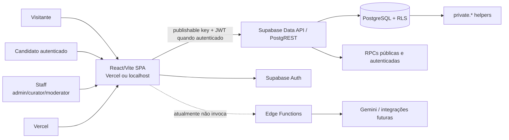
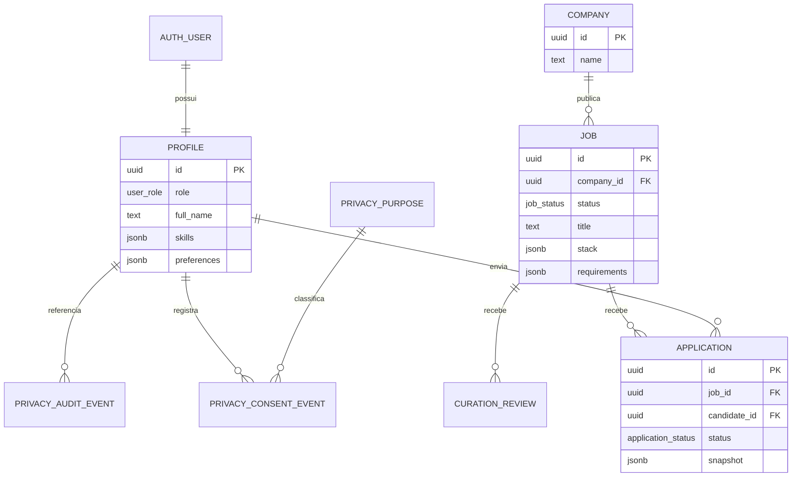

# GDGJobs — Project Overview Técnico

> Documento de entrada para desenvolvedores. Ele explica o que o projeto é, como funciona, onde estão as responsabilidades e quais limites não podem ser ignorados.

**Data da visão:** 17/09/2026  
**Status:** MVP paralelo em homologação e portfólio; não aprovado para operar com titulares reais.  
**Repositório:** `rodrigochavesoa/gdg-lauro-de-freitas`  
**Produto oficial de referência:** [`lfdev-gdg/GDGJobs`](https://github.com/lfdev-gdg/GDGJobs)

## 1. O que é este projeto

O GDGJobs é um MVP paralelo inspirado no problema do GDG Jobs: aproximar profissionais de tecnologia de oportunidades curadas pela comunidade.

Ele existe para:

- praticar Engenharia de Software com uma aplicação realista;
- provar que uma stack enxuta pode entregar catálogo, autenticação, perfil, candidatura e curadoria;
- exercitar segurança, privacidade, acessibilidade, testes e operação;
- servir como portfólio e laboratório de aprendizado com agentes de IA.

Ele **não** é uma cópia do produto oficial e não substitui o repositório da comunidade. O oficial é a fonte de verdade do produto comunitário; este repositório adapta princípios e funcionalidades com outra stack e outro ritmo.

## 2. Resumo para apresentar a outro desenvolvedor

> “Este é um monólito web gerenciado: uma SPA React/Vite entrega a interface, o Supabase concentra PostgreSQL, Auth, Data API, RLS e RPCs, e a Vercel serve o build estático. O núcleo é catálogo curado → perfil → candidatura → curadoria. A autorização real fica no banco, não na interface. O projeto usa dados de teste e tem gates explícitos antes de produção com PII, IA, e-mail transacional ou upload de avatar.”

## 3. Decisões fundamentais

### Stack congelada do MVP

| Camada | Tecnologia | Responsabilidade |
|---|---|---|
| Interface | React + Vite + React Router | SPA, rotas, estados e interação |
| Estilos | CSS próprio com tokens em `src/styles.css` | identidade visual, light/dark, responsividade |
| Dados | Supabase PostgreSQL | fonte de verdade, constraints, estados e índices |
| Identidade | Supabase Auth | Google OAuth para candidatos; e-mail/senha para staff |
| Autorização | RLS + funções/RPCs PostgreSQL | isolamento de dados e operações permitidas |
| Backend complementar | Supabase Edge Functions | integrações sensíveis e futuras, fora do browser |
| Hospedagem | Vercel Hobby | entrega do `dist/` e previews |
| Qualidade | ESLint, Vitest, Playwright/axe, GitHub Actions | validação automática e evidência de entrega |

Não migrar este MVP para Next.js, Tailwind, shadcn/ui, Firebase ou outro provedor sem decisão explícita do mantenedor.

### Princípios arquiteturais

1. O banco é a fonte de verdade da autorização.
2. A UI pode esconder uma ação, mas nunca é o único controle de segurança.
3. O cliente usa apenas URL e chave publishable/anon.
4. Segredos ficam em runtime protegido: GitHub Environment, Edge Function ou serviço externo.
5. Estados inválidos falham fechados quando envolvem privacidade ou autorização.
6. A complexidade só entra quando existe problema medido, requisito claro e rollback.
7. Matching determinístico vem antes de Gemini, embeddings ou colaboração por ML.

## 4. Arquitetura em uma página



### Fronteiras

#### Frontend

Arquivos principais:

- `src/App.jsx`: shell, rotas e gates de autenticação/onboarding;
- `src/shared/ui/`: Header, Footer, tema, menu, acessibilidade e componentes compartilhados;
- `src/features/catalog/`: catálogo, busca e filtros;
- `src/features/auth/`: login, onboarding, sessão, avatar e MFA staff;
- `src/features/jobs/`: detalhe, candidatura e minhas candidaturas;
- `src/features/curation/`: fila, rubrica e timeline;
- `src/features/privacy/`: catálogo, preferências e eventos de consentimento;
- `src/features/portal/`: home/portal e CTA contextual;
- `src/lib/`: clientes e APIs de domínio.

O frontend pode renderizar e solicitar operações. Ele não pode decidir sozinho que alguém é admin, publicar uma vaga, ler dados de outro candidato ou transformar fallback local em consentimento.

#### Supabase/PostgreSQL

É onde vivem:

- dados de domínio;
- constraints e índices;
- papéis e políticas RLS;
- funções RPC;
- estados de candidatura e curadoria;
- auditoria e consentimento.

Os helpers de autorização (`is_admin`, `is_curator`, `is_moderator`, `can_review_curation`) foram movidos para `private.*`, fora da superfície RPC pública do PostgREST.

#### Edge Functions

Existem funções para preparação de enriquecimento e matching, mas a SPA atual não as invoca. Integrações externas e segredos nunca devem ser transferidos para o bundle do navegador.

## 5. Usuários e domínio

### Papéis

| Papel | Acesso esperado |
|---|---|
| Visitante | Catálogo público de vagas aprovadas, detalhes, eventos e shells públicos |
| Candidato | Perfil próprio, onboarding, candidaturas próprias, preferências e histórico próprio |
| Curator | Fila e pareceres de curadoria conforme RLS/papel |
| Moderator | Curadoria e resolução de casos conforme RLS/papel |
| Admin | Operações administrativas de empresas, vagas e curadoria |
| PO/DPO | Decisões de produto, privacidade, retenção e gates; não é papel automático no banco |

### Entidades principais



### Estados importantes

**Vaga:** `pending` → `approved` ou `rejected`; uma rejeitada pode voltar para nova rodada por resubmit. Apenas `approved` aparece no catálogo público.

**Candidatura:** `submitted`, `reviewing`, `accepted`, `rejected` ou `withdrawn`. A candidatura usa RPCs e possui prevenção de duplicidade por vaga/candidato.

**Curadoria:** pareceres são históricos e append-only no modelo V1; a publicação depende das regras de quórum e papel.

**Perfil:** o candidato começa com papel `candidate`. A criação e atualização do perfil não permitem que o cliente escolha ou eleve `role`.

## 6. Rotas e fluxos de produto

| Rota | Público | Responsabilidade |
|---|---|---|
| `/` | Público | Portal, busca e CTA contextual |
| `/vagas` | Público | Catálogo curado, filtros, ordenação e paginação |
| `/jobs/:id` | Público/candidato | Detalhe e candidatura quando elegível |
| `/eventos` e `/eventos/:slug` | Público | Conteúdo estático de eventos |
| `/newsletter` | Público | Shell/formulário ainda inerte; Resend não ligado |
| `/login` | Visitante | Google OAuth para candidato |
| `/onboarding` | Candidato incompleto | Perfil mínimo antes de candidatar |
| `/minhas-candidaturas` | Candidato | Histórico próprio e retirada permitida no V1 |
| `/perfil` | Candidato autenticado | Edição de perfil (identidade e avatar, quando o flag está ligado); staff é redirecionado |
| `/preferencias` | Candidato | Preferências e histórico de privacidade |
| `/admin` | Staff | Shell: login e-mail/senha e MFA TOTP (quando o flag está ligado); index = painel (`AdminHome`) |
| `/admin/curadoria` | Staff | Fila de curadoria |
| `/admin/ingestao` | Admin (`AdminJobsGate`) | Ingestão de vagas |
| `/admin/vagas` | Admin (`AdminJobsGate`) | Lista de vagas admin |
| `/admin/vagas/nova` | Admin (`AdminJobsGate`) | Formulário de nova vaga |
| `/admin/vagas/:id` | Admin (`AdminJobsGate`) | Detalhe e edição de vaga admin |

Login staff e o desafio MFA não têm rota própria: vivem no shell `Admin` em `/admin`. O produto não provisiona contas staff por esta UI. Curadores e moderadores autenticados usam o painel e a curadoria; ingestão e gestão de vagas permanecem restritas ao papel `admin`. Catch-all desconhecido em `/admin/*` volta para `/admin`.

### Fluxo P0

```text
visitante
  → catálogo de vagas approved
  → detalhe
  → login Google
  → onboarding, se necessário
  → candidatura via RPC
  → acompanhamento em minhas candidaturas

admin
  → cadastra empresa/vaga pending
  → curator/moderator revisam
  → approved volta ao catálogo
```

## 7. Segurança e privacidade

### Modelo de acesso

O browser fala com a Data API. Ter a chave publishable/anon não dá acesso administrativo por si só; a leitura ou escrita depende de RLS, grants, RPCs e do JWT.

O browser **não pode conter**:

- `service_role`;
- `sb_secret_*`;
- senha de banco;
- credenciais staff;
- token de administração do Supabase;
- segredo Gemini, Resend ou outro provedor.

### Controles implementados ou validados

- RLS para catálogo aprovado, perfis, candidaturas, curadoria, consentimento e auditoria;
- candidatos não leem nem alteram dados de outros titulares;
- RPCs administrativas não ficam disponíveis para chamadas indevidas via Data API;
- helpers de autorização fora do schema público do PostgREST;
- rate limit para candidatura;
- headers HTTP de proteção em `vercel.json`;
- CSP, anti-iframe, `nosniff`, Referrer-Policy e Permissions-Policy;
- fail-closed quando o schema de privacidade não existe;
- limpeza de credenciais e hidratação stale após logout;
- secrets privilegiados isolados no GitHub Environment `homolog-rls`;
- manifesto explícito de migrations de produção;
- testes de RLS no harness `scripts/check-rls.mjs`.

### MFA staff

`SEC-STAFF-MFA-01` é o gate TOTP/AAL2 da interface `/admin`, ativado somente por `VITE_STAFF_MFA_REQUIRED="true"`. `SEC-STAFF-MFA-02` exige JWT `aal=aal2` nas policies e RPCs staff (`private.*_aal2()`). A migration é Camada B: homologação na cadeia; produção só com PO (`prod.manifest.json` não a inclui).

Candidatos (Google OAuth) não usam MFA staff. O toggle Enhanced MFA Security do Dashboard não substitui o RLS AAL2.

O provisionamento de `admin`, `curator` e `moderator` permanece fora da UI
pública. O fluxo futuro de convite controlado está registrado em
[`docs-local/staff-provisioning-future.md`](docs-local/staff-provisioning-future.md)
e só deve ser aberto após os gates de produção, MFA/AAL2, auditoria, retenção,
continuidade e offboarding estarem maduros.

### Privacidade

O catálogo de finalidades F-01…F-10 e os eventos de consentimento existem, mas bases legais, retenção, textos finais e direitos do titular ainda dependem de decisão humana. Não inventar prazo, base legal ou texto jurídico.

Quando o schema de privacidade está ausente, a aplicação mostra indisponibilidade e não considera o catálogo local como consentimento.

### IA e matching

O matching semântico/Gemini não é fundação do MVP. A ordem planejada é:

1. matching determinístico e explicável (`MVP-012`);
2. consentimento e política de dados;
3. gate F-020/C-04;
4. somente então Gemini/embeddings (`MVP-006`/`MVP-016`).

Enquanto isso, `match-jobs` permanece despublicada e o handler responde `403` sem ler perfil nem chamar o provedor, até o gate MVP-005.

## 8. Ambientes, dados e segredos

| Ambiente | Vercel | Supabase | Dados |
|---|---|---|---|
| Local | `pnpm dev` | `.env.local` apontando ao ambiente escolhido | teste local/homolog |
| Preview | deploy de branch | homologação | seed e contas fictícias |
| Production | deploy de `main` | projeto separado | sem seed fictício; não autorizado para PII real |

As URLs e chaves são configuradas por ambiente. Nunca apontar Preview/local para o banco de produção.

Variáveis esperadas, sem valores neste documento:

```text
VITE_SUPABASE_URL
VITE_SUPABASE_PUBLISHABLE_KEY
VITE_SUPABASE_ANON_KEY        # compatibilidade/fallback em alguns scripts
VITE_STAFF_MFA_REQUIRED       # false/ausente por padrão
VITE_AVATAR_UPLOAD_ENABLED    # só "true" liga upload; Production ausente até Camada B
SUPABASE_SERVICE_ROLE_KEY     # somente runtime protegido/Environment homolog-rls
*_TEST_EMAIL                  # somente Environment protegido
*_TEST_PASSWORD               # somente Environment protegido
```

As chaves publishable/anon podem aparecer no browser; isso não torna RLS opcional. `service_role` e senhas nunca devem aparecer no repositório, no bundle, em PR, em log ou em Repository secrets desnecessários.

## 9. Banco, migrations e operação

A raiz de `supabase/migrations/` é o path que `supabase db push` aplica e só pode conter o manifesto. SQL homolog-only fica em `supabase/migrations/homolog/`. Camada B fica em `supabase/migrations/held/`. O CLI não lê essas subpastas.

`pnpm migrations:prod` valida a raiz contra o manifesto e não aplica SQL. `pnpm migrations:homolog` lista a cadeia completa. `pnpm migrations:homolog:apply` aplica essa cadeia com `psql` só se o project ref da URL for `HOMOLOG_SUPABASE_PROJECT_REF`. Versões já gravadas em `supabase_migrations.schema_migrations` são puladas. Arquivos homolog-only ou marcados “Produção: não aplicar” não entram no manifesto.

A migration `20260915154949_job_submission_staff_dedup.sql` permanece fora do manifesto até aceite da Camada B.

As migrations `20260920010148_job_ingestions_source_contract_homolog.sql`, `20260920020100_job_ingestions_register_rpc_homolog.sql` e `20260920040000_job_ingestions_process_homolog.sql` são **homolog-only** (sufixo `_homolog.sql` em `pnpm migrations:prod`). Tabela `job_ingestions`: fingerprint `(source_kind, normalized_locator, payload_hash)` independente da deduplicação MVP-010 em `jobs`. `payload_hash` é recalculado em `register_job_ingestion`; o cliente não escolhe o digest. `process_job_ingestion` materializa vaga **pending**, grava tentativas auditáveis e não publica. Sem apply em produção. Uma futura `job_ingestions_*_prod.sql` não entra no pattern `_homolog.sql`.

A migration `20260920030000_staff_cannot_apply_homolog.sql` (SEC-STAFF-APPLY-01) é **homolog-only**. `apply_to_job` e `withdraw_application` recusam papéis staff. Sem apply em produção.

O prefixo legado `avatars_` em `HOMOLOG_ONLY_PATTERN` continua amplo (`avatars_versioned_path.sql` / `avatars_single_object.sql` sem `_homolog`). Não é regressão do MVP-013; o follow-up **GOV-AVATAR-MIG-CLASS-01** reclassifica esses arquivos antes da Camada B de avatar.

Antes de qualquer migration produtiva, confirmar:

1. projeto Supabase correto;
2. ambiente e backup;
3. manifesto e checksum/SQL revisados;
4. rollback ou plano de reversão;
5. evidência no ClickUp e aprovação do PO.

## 10. Qualidade e fluxo de entrega

### Comandos principais

```text
pnpm install
pnpm dev
pnpm lint
pnpm test
pnpm build
pnpm check:bundle
pnpm migrations:prod
pnpm test:rls
pnpm qa:a11y
```

`pnpm test:rls` é um teste defensivo contra homologação e pode criar dados fictícios controlados. Nunca apontar o harness para produção sem autorização explícita e sem garantir que não haverá escrita.

### CI

Em PRs, o job não recebe secrets privilegiados e executa a validação segura de código, testes, build, bundle e manifesto. O job `RLS homolog` utiliza o GitHub Environment `homolog-rls` somente no contexto autorizado, principalmente após merge em `main`/execução manual.

O ruleset `Protect main` exige os checks de qualidade configurados antes do merge. O processo preservado é:

```text
ONE-LINER / história
  → branch de feature
  → implementação do Executor
  → lint, testes, build e evidências
  → revisão Plan/PO
  → validação manual quando necessário
  → squash merge em main
  → RLS homolog pós-merge
  → atualização ClickUp
```

Não alterar esse fluxo para acelerar uma entrega.

## 11. Acessibilidade e UX

O projeto adota WCAG 2.2 AA como meta interna progressiva, sem declarar certificação.

Já existem, no recorte validado:

- skip link e landmark `main`;
- foco visível e navegação por teclado;
- estados de carregamento, erro e vazio anunciados;
- `prefers-reduced-motion`;
- responsividade mobile;
- tokens semânticos para dark mode;
- baseline axe report-only;
- correções de contraste para CTA e marca no dark.

Limites atuais:

- axe não é certificação WCAG;
- nem todos os fluxos autenticados foram cobertos em todas as combinações;
- o hero do portal ainda possui cores hardcoded;
- VLibras é complemento planejado para a sprint final, não substituto de acessibilidade nativa;
- declaração pública deve dizer “acessibilidade em evolução”, sem selo de certificação.

## 12. O que está entregue, parcial ou bloqueado

### Entregue no núcleo

- catálogo público de vagas aprovadas;
- busca, filtros, ordenação e paginação inicial;
- autenticação Google para candidato;
- onboarding e perfil mínimo;
- candidatura e retirada V1;
- minhas candidaturas;
- curadoria com fila, rubrica, quórum e histórico;
- administração staff de empresas/vagas em homologação;
- RLS, hardening de RPC e helpers privados;
- headers HTTP e pipeline de qualidade;
- consentimento/auditoria em homologação;
- baseline de acessibilidade e correções mobile;
- manifesto de migrations de produção.

### Parcial ou com ressalva

- privacidade em produção: fallback fail-closed, mas migration definitiva depende da Camada B;
- MFA: UI `/admin` gated por flag; RLS AAL2 em homologação (Camada B — produção só com PO);
- avatar: fluxo endurecido em homologação, upload de produção desligado;
- acessibilidade: meta interna, não certificação;
- desempenho: paginação e medições pontuais, sem SLO comprometido;
- eventos e newsletter: shells públicos, sem Resend;
- produção: demo/portfólio, não operação com PII real.

### Bloqueado ou backlog

- `MVP-004`: direitos do titular, exportação, correção, exclusão e retenção;
- `MVP-006`/F-020: Gemini e matching semântico;
- `MVP-007`: backup, restore e incidentes reais;
- `MVP-012`: matching determinístico explicável;
- `MVP-014`: observabilidade e métricas;
- Apply em produção da migration AAL2 (`staff_rls_aal2`) — Camada B / PO;
- `SEC-STAFF-PROVISIONING-01`: convite e provisionamento staff controlados;
- `SEC-CI-02`: política para PRs de fork;
- Resend/domínio/e-mail transacional;
- portal completo de empresa/recrutador e currículo, revisão prevista na Sprint 28;
- VLibras na sprint final.

## 13. O que um desenvolvedor novo deve fazer

### Primeiro contato

1. Ler este arquivo, `README.md`, `SETUP.md` e `CONTRIBUTING.md`.
2. Ler `docs-local.example/` apenas como modelo; `docs-local/` contém material operacional local e ignorado.
3. Confirmar que está no repositório paralelo, não no oficial.
4. Instalar Node 22 e pnpm conforme o setup.
5. Criar `.env.local` sem copiar segredos para commits.
6. Rodar `pnpm lint`, `pnpm test` e `pnpm build` antes de alterar código.

### Para entender o código

Leia nesta ordem:

1. `src/App.jsx` — rotas e gates;
2. `src/features/auth/auth-api.js` — sessão e perfil;
3. `src/lib/supabase-client.js` — cliente browser;
4. `src/lib/jobs-api.js` e `src/features/catalog/` — catálogo;
5. `src/features/jobs/` — candidatura;
6. `src/features/curation/` e `src/lib/admin-api.js` — staff;
7. `src/features/privacy/` — consentimento e fail-closed;
8. `supabase/migrations/` — contratos reais de dados e autorização;
9. `scripts/check-rls.mjs` — cenários defensivos;
10. `vercel.json` e `.github/workflows/ci.yml` — entrega e proteção.

### Antes de abrir uma PR

- identificar a fronteira alterada: UI, API, banco, Auth, RLS, CI ou deploy;
- verificar se há PII, segredo, migration ou mudança de permissão;
- escrever teste de sucesso, falha e autorização;
- confirmar que o estado de erro não vira estado vazio silencioso;
- rodar os gates locais;
- registrar evidência e rollback;
- não executar escrita em produção.

## 14. Regras que evitam os erros mais perigosos

Não faça:

- colocar `service_role` no `.env` versionado, bundle, PR ou Repository secret;
- usar UI como autorização;
- aceitar `role` vindo do formulário do candidato;
- aplicar uma migration apenas porque o nome parece “prod-safe”;
- tratar fallback local como consentimento;
- ligar Gemini só porque a Edge Function existe;
- ativar MFA ou avatar em produção sem teste de homolog e decisão do PO;
- declarar “WCAG certificado” por causa de um scan axe;
- adicionar cache, fila, microserviço ou IA sem métrica que justifique;
- apontar Preview ou testes para produção;
- apagar dados de teste sem escopo e confirmação.

## 15. Documentos relacionados

| Documento | Uso |
|---|---|
| `SETUP.md` | instalação e configuração pública |
| `CONTRIBUTING.md` | processo de branch, PR e entrega |
| `docs-local/system-design-roadmap.md` | critérios de System Design e sequência de sprints |
| `docs-local/doc-arch-01-architecture-boundaries.md` | mapa detalhado das fronteiras |
| `docs-local/doc-req-01-requirements-matrix.md` | requisitos funcionais e não funcionais |
| `docs-local/security-project-bootstrap.md` | configuração inicial de segurança |
| `docs-local/guideline-engineering-learnings.md` | aprendizados humanos de engenharia |
| `docs-local/guideline-agents-project-bootstrap.md` | orientação operacional para agentes |
| `docs-local/mvp-sprint-plan-and-handoffs.md` | sprints e ONE-LINERs |
| `docs-local/staff-provisioning-future.md` | decisão e desenho futuro do provisionamento staff |
| `supabase/migrations/prod.manifest.json` | migrations autorizadas para produção |

## 16. Estado de confiança

A aplicação possui um núcleo técnico consistente para um MVP de portfólio e homologação. Isso não equivale a estar pronta para uma operação pública com dados pessoais reais.

O próximo nível de maturidade não é trocar a stack. É fechar, nesta ordem, os gates de produção: enforcement de autorização, privacidade e retenção, backup/restore, observabilidade, MFA operacional, revisão de dependências e validação dos fluxos de empresa/recrutador.

Quando uma decisão parecer grande demais, volte às quatro perguntas:

1. Qual carga e latência precisamos suportar?
2. Qual é a fonte de verdade e qual invariável não pode quebrar?
3. O que acontece quando a dependência falha ou a sessão é inválida?
4. Como detectamos, explicamos, revertemos e auditamos a mudança?

Se a pergunta não tiver resposta mensurável, ainda não é hora de adicionar complexidade.
