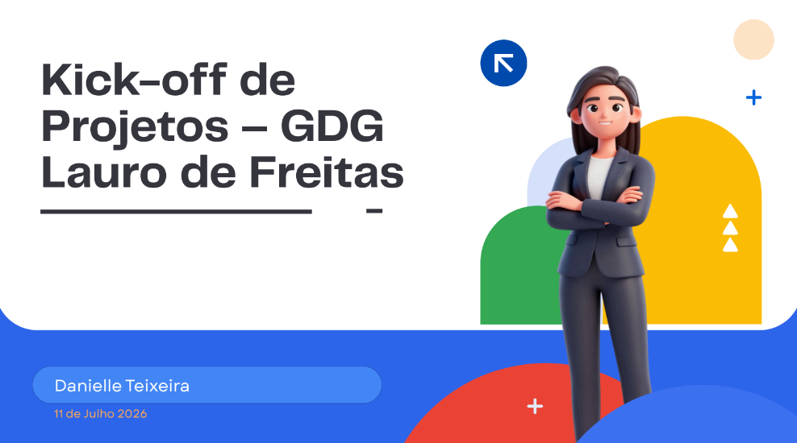

<p align="center">
  
</p>

<p align="center">
  <a href="https://github.com/rodrigochavesoa/gdg-lauro-de-freitas/actions/workflows/ci.yml">
    
  </a>
  <a href="https://www.conventionalcommits.org/pt-br/v1.0.0-beta.4/">
    
  </a>
  <br />
  
  
  
  
  
  
  <br />
  
  
</p>

# GDG Lauro de Freitas - Ecossistema de Projetos

Este repositório centraliza as definições, arquitetura e planejamento estratégico para o desenvolvimento da plataforma digital do Google Developer Group (GDG) Lauro de Freitas. O ecossistema é composto por três projetos principais voltados para o impacto e engajamento da comunidade local.

---

## 🚀 Projetos em Pauta

1. **Site Oficial do GDG:** Linha do tempo dos meetups, painel com métricas de impacto da comunidade e módulo inicial de vagas.
2. **GDGLAURO Jobs:** Um motor inteligente e curado para mapeamento, recomendação e matching de vagas de tecnologia.
3. **GDGLAURO Language:** Plataforma focada em capacitação para *Tech Interviews* (perguntas comuns, vocabulário técnico e Método STAR) aplicada ao desenvolvimento mobile.

---

## 🏗️ Arquitetura e Stack Técnica (GDGLAURO Jobs)

O kick-off do ecossistema GDG descreveu uma stack **completa** (Next.js, Tailwind, shadcn, Gemini, ML, etc.). O repositório **hoje** entrega o **MVP de homologação** em outra combinação — de propósito. Abaixo: o que está em uso, a visão alvo e **quando** cada tecnologia do escopo passa a fazer sentido.

**Fase 1 (atual):** buscar **$0/mês** em desenvolvimento/homologação, com dados fictícios ou autorizados — sem promessa de escala de produção. Detalhes de custo: [`docs/project-backlog-scrum.md`](docs/project-backlog-scrum.md).

### MVP atual — o que roda neste repositório (Sprints 1–3+)

| Camada | Stack em uso | Papel |
|---|---|---|
| **Frontend** | React 19 + **Vite 8**, CSS com tokens do Design System (DS-02) | SPA: Home, detalhe, Admin mockado, Login |
| **Dados & auth** | **Supabase** — PostgreSQL, RLS, Auth (preparação admin; Google OAuth no Sprint 5) | Catálogo `approved`, policies, Edge Functions preparadas |
| **Cliente** | `@supabase/supabase-js` (publishable/anon no browser) | Leitura pública e futuro CRUD admin — **sem** `service_role` no frontend |
| **Qualidade** | ESLint 9, Vitest 3, GitHub Actions | `lint`, `test`, `build` em todo PR |
| **Hospedagem (decidida C-01)** | **Vercel** — deploy de `dist/` estático | Preview/homologação; produção pública só após gates LGPD |
| **IA / ML** | Migration + Edge Functions **preparadas**; Gemini **não conectado** | Sprint 9+ |

**Por que Vite (e não Next.js) nesta fase:**

1. **Herança do protótipo** — a UI (Home, detalhe, Admin, DS-02) já existia em React/Vite antes das Sprints 1–2; migrar framework agora atrasaria catálogo, RLS e admin sem ganho imediato.
2. **Backend no Supabase** — regras de negócio, RLS e Edge Functions ficam no Supabase; o browser consome API REST/RPC. Não precisamos de API Routes ou SSR do Next para o MVP.
3. **Custo e simplicidade** — build estático (`pnpm run build` → `dist/`), CI verde, deploy na Vercel com fricção mínima na Fase 1.
4. **Escopo de sprint** — S1 (CI), S2 (catálogo), S3 (admin CRUD) foram planejados sobre Vite; troca de framework não está no backlog imediato.

Autenticação: **Supabase Auth** (não Firebase Auth). Google OAuth entra no Sprint 5.

### Visão alvo — stack do escopo do ecossistema (pós-MVP)

Stack solicitada no planejamento estratégico do GDG Lauro — **não descartada**, **não totalmente implementada**:

| Tecnologia | Papel na visão | Quando adotar |
|---|---|---|
| **Next.js 14+ (App Router)** | Site unificado, rotas server-side, SEO de vagas públicas, middleware de auth | Quando houver necessidade de **SEO indexável**, integração forte com Site GDG ou BFF server-side — **decisão de PO/Tech Lead**, provavelmente pós-Sprint 6 ou produção inicial |
| **Tailwind CSS + shadcn/ui** | UI escalável alinhada ao escopo inicial | Quando PO fechar migração de UI (pendência no backlog); preferível **antes** ou **junto** de migração Next, para não refatorar duas vezes |
| **Next.js API Routes / Vercel Edge** | Endpoints server-side complementares | Só se Supabase Edge Functions + RLS **não** cobrirem um fluxo; evitar duplicar backend |
| **Supabase** (PostgreSQL, RLS, Storage, Realtime, `pgvector`) | Fonte de verdade, auth, arquivos, busca semântica | **Já em uso** — expande em S3–S12 (admin, curadoria, candidaturas, matching) |
| **Gemini API** | Enriquecimento de vagas com revisão humana | Sprint 9+, após política C-04 e gate LGPD |
| **Xenova/ONNX, scikit-learn, `pgvector`** | ML e recomendação V2/V3 | Sprints 10–12; fairness e ADR-001/002 |
| **Resend** | E-mails transacionais | Sprint 7 |
| **GitHub Actions** | CI/CD | **Já em uso** |

### Critérios para sair do MVP Vite

Migrar ou reescrever em Next.js **só** quando **pelo menos dois** destes gatilhos forem aceitos pelo Product Owner + Tech Lead:

- Páginas de vaga precisam de **SEO** e compartilhamento social em produção.
- **Site Oficial GDG** e GDGJobs devem compartilhar o mesmo App Router / layout.
- Volume ou requisitos de **auth server-side** (middleware, cookies httpOnly) superarem o modelo SPA + Supabase Auth.
- **Tailwind + shadcn** aprovados e orçados — migração visual + framework numa janela planejada.

Até lá, evoluir o produto **no Vite atual** conforme [`docs/project-backlog-scrum.md`](docs/project-backlog-scrum.md).

---

## 🔄 Fluxo de Dados End-to-End

O pipeline de processamento do motor de vagas opera em 5 etapas principais:

1.  **Ingestão:** Coleta através de Scrapers, submissões manuais e APIs externas.
2.  **Curadoria:** Validação automatizada, revisão pela comunidade e aplicação de rubricas.
3.  **Enriquecimento:** Uso da **Gemini API** para geração de tags automáticas e embeddings.
4.  **Armazenamento:** Persistência no Supabase utilizando `pgvector` e aplicação estrita de *Row-Level Security* (RLS).
5.  **Recomendação:** Execução do modelo de Machine Learning integrado a um ciclo de feedback contínuo do usuário.

---

## 🧠 Motor de Recomendação (ML com Fairness)

As recomendações inteligentes combinam equidade, explicabilidade e busca semântica através de um score ponderado:

$$\text{Score Final} = (0.5 \times \text{Semântico}) + (0.3 \times \text{Colaborativo}) + (0.2 \times \text{Regras})$$

*   **Camada 1: Embeddings (Peso: 0.5):** Similaridade semântica entre o perfil do candidato e a vaga via `pgvector`.
*   **Camada 2: Filtragem Colaborativa (Peso: 0.3):** Identificação de padrões coletivos por matriz usuário-vaga.
*   **Camada 3: Regras + Fairness (Peso: 0.2):** Diversidade forçada, correção de viés e explicabilidade via SHAP, garantindo a não-discriminação por gênero, idade ou localização.

---

## 🛡️ Segurança e Privacidade (LGPD por Design)

Conformidade e governança de dados integradas desde o primeiro dia de desenvolvimento:

*   **Consentimento Granular:** Autonomia para o usuário escolher o que compartilhar.
*   **Isolamento Absoluto:** *Row-Level Security* (RLS) direto no banco de dados para impedir acessos cruzados.
*   **Direitos do Titular:** Opções nativas para exportação, correção e exclusão de dados a qualquer momento.
*   **Auditoria Completa:** Registro e log detalhado de todas as operações e acessos a dados pessoais.
*   **Anonimização:** Dados pessoais passam por processamento de anonimização antes de alimentar os modelos de ML.
*   **Gestão de Incidentes:** Protocolo estruturado de notificação em conformidade com as diretrizes da ANPD.

Inventário de dados pessoais (S1-03): [`docs/lgpd-data-inventory.md`](docs/lgpd-data-inventory.md).

---

## 🎨 Design System

Garantia de consistência visual e integridade da marca em todos os pontos de contato:

*   Uso de tokens globais de cores e tipografia alinhados à identidade oficial do GDG e diretrizes do Google.
*   Biblioteca compartilhada de componentes desenvolvida no Figma, servindo de forma cross-platform ao Site, Jobs e Language.

Referência operacional do MVP: [`docs/design-system-communication.md`](docs/design-system-communication.md).

---

## 📅 Organização e Próximos Passos

O acompanhamento e as tarefas do time seguem o planejamento estruturado:

*   **Gestão de Demandas:** Utilização do ClickUp e Trello para rastreamento de tarefas e progresso.
*   **Padrões de Engenharia:** Configuração de Gitflow, padronização de commits e sincronizações semanais assíncronas.

Backlog e sprints: [`docs/project-backlog-scrum.md`](docs/project-backlog-scrum.md).

Para dúvidas ou suporte, entre em contato através do e-mail oficial da comunidade: [gdglaurodefreitas@gmail.com](mailto:gdglaurodefreitas@gmail.com).

---

## Desenvolvimento local — GDGJobs (MVP Vite)

O incremento **em execução** neste repositório é o MVP **React/Vite** descrito acima — catálogo no Supabase de **teste** (Sprint 2 concluída). Use **PowerShell (`pwsh`)** no Windows (não use WSL).

```powershell
Copy-Item .env.example .env.local
# Preencher URL e publishable key via canal seguro — nunca commitar

pnpm install
pnpm lint
pnpm test
pnpm run build
```

Contribuição (branch + PR, [Conventional Commits](https://www.conventionalcommits.org/pt-br/v1.0.0-beta.4/)): [`docs/contributing.md`](docs/contributing.md). Segurança: [`docs/security-and-documentation.md`](docs/security-and-documentation.md). Supabase teste: [`docs/supabase-dev-env.md`](docs/supabase-dev-env.md). Catálogo e RLS: [`docs/s2-catalog-rls.md`](docs/s2-catalog-rls.md).
