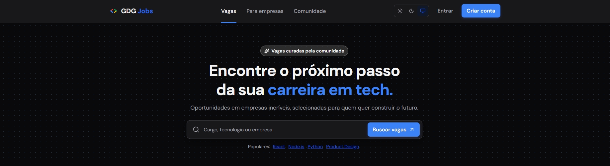

  

  
  
   
  
  
  
  
  
  
   
  
  
  

# GDGJobs — MVP de homologação

Laboratório **React/Vite + Supabase** para estudar o motor de vagas da comunidade GDG Lauro de Freitas: catálogo público, auth, curadoria e candidatura, com RLS e LGPD by design. Dados de teste; **não** é o produto oficial.

**Estado atual: homologação**, não produção. O marco **Beta 0.1** (ambiente separado, direitos do titular, backup restaurável) ainda não foi atingido.

Núcleo do recorte: **catálogo curado → perfil → candidatura → curadoria**. IA (Gemini/`pgvector`) é preparação, não fundação.

  

## Relação com o repositório oficial

| | Comunidade | Este repositório |
|---|---|---|
| **Onde** | [**lfdev-gdg/GDGJobs**](https://github.com/lfdev-gdg/GDGJobs) | MVP Vite + Supabase (paralelo) |
| **Propósito** | Plataforma curada pela GDG (vagas nacionais e internacionais) | Homologação e aprendizado |
| **Stack** | Next.js, Tailwind, shadcn/ui | React 19, Vite 8, CSS com tokens próprios |
| **Condução** | **Danielle Teixeira** — visão e entrega do GDG Jobs oficial | Estudo; **não substitui** o oficial |

Quer contribuir com o **produto da comunidade**? Comece por [lfdev-gdg/GDGJobs](https://github.com/lfdev-gdg/GDGJobs). Issues e PRs aqui são bem-vindos neste laboratório, sempre com o repo oficial como fonte de verdade do produto.

## Stack congelada

A stack abaixo é a decisão do MVP paralelo. **Não migrar** neste recorte sem decisão explícita do mantenedor.

| Camada | Decisão | Regra |
|---|---|---|
| Frontend | React 19 + Vite 8, SPA, CSS com tokens em `src/styles.css` | Sem Next.js, Tailwind ou shadcn/ui |
| Dados e auth | Supabase PostgreSQL + Auth + RLS | Banco é a fonte de verdade; chave publishable/anon no browser |
| Backend complementar | Supabase Edge Functions (TypeScript) | Segredos e integrações fora do navegador |
| Qualidade | ESLint 9, Vitest 3, GitHub Actions (`lint` / `test` / `build`) | Entrega deixa evidência verificável |
| Hospedagem prevista | Vercel servindo `dist/` estático | Confirmar plano e ambiente de **produção** à parte (ainda não é este repo em prod) |

Auth: **Supabase Auth** (Google OAuth em homologação). Sem `service_role` no frontend.

## Não-objetivos

- Reescrever o projeto para copiar o repositório oficial (`lfdev-gdg/GDGJobs`) linha a linha.
- Trocar a stack (Next.js, Tailwind, shadcn/ui, outro provedor de auth).
- Tratar IA (Gemini, busca semântica, recomendação colaborativa) como fundação do produto — o catálogo precisa funcionar com filtros determinísticos se a IA estiver desligada.
- Chamar o estado atual de produção, beta com PII real ou substituto do produto da comunidade.

## Documentação pública

| Arquivo | Conteúdo |
|---|---|
| [**SETUP.md**](SETUP.md) | Node 22, pnpm, `.env.local`, `pnpm dev`, testes, RLS |
| [**CONTRIBUTING.md**](CONTRIBUTING.md) | Branch, PR, Conventional Commits, papéis Plan / Executor |
| [**LICENSE**](LICENSE) | MIT — GDG Lauro de Freitas, 2026 |

Documentação operacional (backlog, design system, evidências QA, regras de agentes) fica só na máquina do mantenedor, em `docs-local/` — modelo em [`docs-local.example/`](docs-local.example/).

Contato da comunidade: [gdglaurodefreitas@gmail.com](mailto:gdglaurodefreitas@gmail.com).
