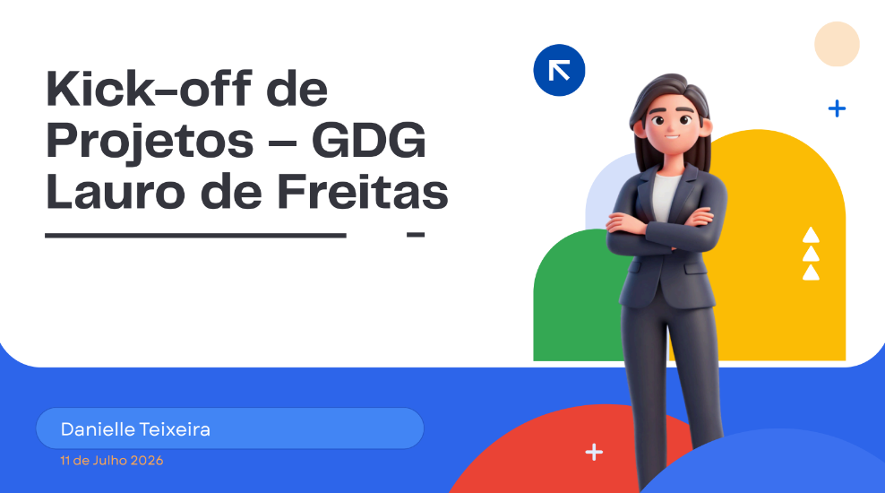
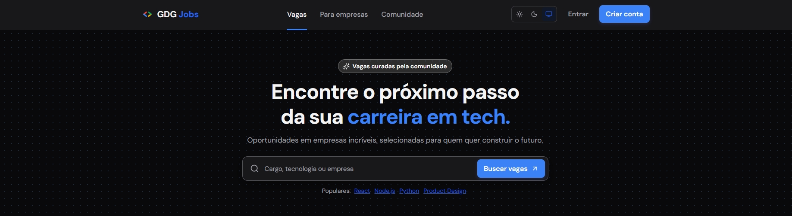

<p align="center">
  
</p>

<p align="center">
  <a href="https://github.com/rodrigochavesoa/gdg-lauro-de-freitas/actions/workflows/ci.yml">
    
  </a>
  <a href="https://www.conventionalcommits.org/pt-br/v1.0.0-beta.4/">
    
  </a>
  <br />
  
  
  
  
  
  
  <br />
  
  
  
</p>

# GDGJobs

Um laboratório de Engenharia de Produto para construir, testar e evoluir uma experiência de vagas curadas pela comunidade.

O GDGJobs aproxima profissionais de tecnologia de oportunidades relevantes. A experiência começa no catálogo, passa pelo detalhe da vaga e pela candidatura, e termina em uma curadoria responsável antes que uma vaga chegue ao público.

<p align="center">
  
</p>

## O problema que estamos resolvendo

Encontrar uma vaga relevante não deveria depender de navegar por fontes dispersas, interpretar informações inconsistentes ou confiar em publicações sem contexto. O projeto explora uma resposta comunitária para esse problema:

- reunir oportunidades em um catálogo simples;
- melhorar a qualidade por meio de curadoria;
- reduzir atrito entre descobrir uma vaga e candidatar-se;
- criar uma base segura para personalização futura.

## Como o produto funciona

```text
descobrir → entender → completar perfil → candidatar-se → acompanhar
                         ↑
                 curadoria da comunidade
```

Visitantes exploram vagas aprovadas, filtram o catálogo e consultam os detalhes. Candidatos autenticados completam o perfil, candidatam-se e acompanham o próprio histórico. A equipe staff recebe vagas, revisa o conteúdo e controla o que pode ser publicado.

## O que já foi construído

- catálogo público com busca, filtros, ordenação e paginação;
- detalhe da vaga e candidatura com estados claros de carregamento, erro e retry;
- login do candidato, onboarding, perfil e preferências;
- curadoria com fila, prioridade, pareceres, rodadas e moderação;
- painel administrativo para empresas, vagas e ingestão controlada;
- experiência responsiva, tema claro/escuro e acessibilidade em evolução;
- segurança de dados com RLS, autorização no banco, rate limit e trilha de auditoria;
- pipeline de qualidade com testes, build e validações antes do merge.

## Onde este projeto se encaixa

Este é um projeto paralelo, de homologação, portfólio e aprendizado. Ele não é o produto oficial da comunidade e não substitui o [GDGJobs oficial](https://github.com/lfdev-gdg/GDGJobs), que continua sendo a referência do produto comunitário.

O paralelo usa a mesma inspiração de produto, mas mantém seu próprio ritmo, arquitetura e decisões de engenharia. O objetivo é aprender construindo uma experiência coerente, segura e mensurável — não copiar outro repositório linha a linha.

## Como o produto evolui

**V1 — Catálogo curado**

Valor imediato: encontrar vagas, entender oportunidades, candidatar-se e garantir revisão comunitária.

**V2 — Contexto do candidato**

Perfis mais completos, preferências, filtros mais úteis e fluxos graduais para empresas e recrutadores.

**V3 — Recomendação responsável**

Matching determinístico e explicável primeiro; embeddings e IA somente depois de fechar privacidade, consentimento, governança e métricas.

## Comece pela documentação certa

- [**ABOUT.md**](ABOUT.md) — guia completo do produto, funcionalidades, jornadas, estados e limites atuais.
- [**SETUP.md**](SETUP.md) — como executar localmente, configurar ambientes e validar a instalação.
- [**PROJECT_OVERVIEW.md**](PROJECT_OVERVIEW.md) — arquitetura, fronteiras, dados, segurança e decisões técnicas.
- [**CONTRIBUTING.md**](CONTRIBUTING.md) — fluxo de trabalho, branches, PRs e critérios de entrega.
- [`docs/adr/`](docs/adr/) — decisões arquiteturais versionadas.
- [`docs/agents/`](docs/agents/) — mapa de contexto para agentes e ferramentas de engenharia.

## Estado atual

O núcleo funciona em homologação com dados de teste. A cadeia de produção e seus controles evoluem por gates separados; isso não significa autorização para operar PII real, ativar integrações externas ou ligar IA no produto.

Antes de propor uma nova camada, consulte o [ABOUT.md](ABOUT.md), confirme a fonte de verdade no [PROJECT_OVERVIEW.md](PROJECT_OVERVIEW.md) e siga o [SETUP.md](SETUP.md). Complexidade só entra quando existe uma necessidade medida, um contrato claro e uma forma segura de reverter.

## Licença e contato

Este repositório usa licença MIT. Consulte o [LICENSE](LICENSE) para o texto completo.

Para o contexto da comunidade GDG Lauro de Freitas, consulte o [repositório oficial GDGJobs](https://github.com/lfdev-gdg/GDGJobs). O contato público informado pelo projeto é [gdglaurodefreitas@gmail.com](mailto:gdglaurodefreitas@gmail.com).
