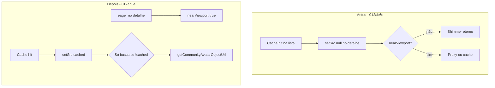

# Comunidade — avatares: troubleshooting e lições aprendidas

**Feature:** `UX-COMMUNITY-PROFILES-01`  
**Contrato base:** [COMMUNITY-PROFILES.md](./COMMUNITY-PROFILES.md) (proxy autenticado, bucket privado, sem path/UID no browser)  
**Commits de referência:** `0796fbf` (proxy seguro + medição QA), `012ab6e` (lista ↔ detalhe + remoção de atalho por nome)

Este documento existe para **não repetir** investigações longas quando o sintoma parece “foto sumiu”, “só carrega para mim” ou “fica carregando para sempre”. Não substitui o registro operacional do piloto em `docs-local/community-homolog-preview-pilot.md`.

---

## Arquitetura esperada (resumo)

| Camada | Comportamento |
|--------|----------------|
| Lista/detalhe | RPC allowlist; `avatarAvailable` é só booleano |
| Carregamento | `getCommunityAvatar` → Edge `community-avatar` (JWT + origem allowlist) → bytes → `blob:` em memória |
| Cache sessão | `community-avatar-cache.js`: um `blob:` por `publicId`, prefetch paralelo (6 workers), `revoke` ao sair de `/comunidade` |
| **Proibido** | URL assinada do Storage no ``, wildcard `*.vercel.app`, reutilizar foto do header por nome igual |

---

## Sintoma A — Outros membros sem foto (iniciais / “Sem foto de …”); a sua aparece

### O que o usuário vê

- Cartão ou detalhe com `community-avatar--fallback` e `aria-label="Sem foto de …"`.
- A foto do **header** (conta logada) continua normal.
- A lista mostra `avatarAvailable: true` (há foto no backend).

### Causa mais comum (Preview / homolog)

A Edge Function **só responde com CORS** se o header `Origin` do browser estiver em `COMMUNITY_AVATAR_ALLOWED_ORIGINS`. Deploy do frontend na Vercel **não** atualiza esse secret nem redeploya a função automaticamente.

Cada deployment Preview ganha um hostname **novo** (`…-<hash>-gdg-jobs-prod.vercel.app`). Se só um hash antigo está na allowlist, o Preview **atual** recebe **403** no preflight; o `fetch` falha e o React cai em fallback (não é “foto removida”).

### Diagnóstico (DevTools → Network, filtrar `community-avatar`)

| Status | Interpretação |
|--------|----------------|
| `OPTIONS` **403** ou sem `Access-Control-Allow-Origin` | Origem do Preview **ausente** da allowlist |
| `GET` **401** | Sessão/JWT não enviado ou inválido |
| `GET` **404** | Sem avatar publicado / RPC sem path autorizado |
| `GET` **429** | Orçamento 60 leituras/min do usuário |
| `GET` **503** | RPC, Storage ou função mal configurada |
| `GET` **200** + `image/*` | Proxy OK; se a UI falha, investigar frontend (Sintoma B) |

Teste rápido (mantenedor, sem expor tokens no chat):

```bash
# Substituir PREVIEW_ORIGIN pela origem exata (https://…, sem barra final)
curl -s -o /dev/null -w "%{http_code}\n" -X OPTIONS \
  "https://<PROJECT_REF>.supabase.co/functions/v1/community-avatar?publicId=<uuid-v4>" \
  -H "Origin: PREVIEW_ORIGIN" \
  -H "Access-Control-Request-Method: GET" \
  -H "Access-Control-Request-Headers: authorization,apikey"
```

Esperado após correção: **204** e resposta com `Access-Control-Allow-Origin: PREVIEW_ORIGIN`.

### Correção (homolog; não é migration nem produção)

1. Listar origens que **já funcionam** (localhost, alias de produção/preview antigos) e **acrescentar** a origem exata do Preview atual e, se usada, o alias estável da branch.
2. Atualizar secret `COMMUNITY_AVATAR_ALLOWED_ORIGINS` no projeto Supabase de homolog (vírgulas, sem espaços extras, **sem** `*.vercel.app`).
3. `supabase functions deploy community-avatar --project-ref <HOMOLOG_REF>`.
4. Confirmar `OPTIONS` 204 e `GET` 200 logado no Preview; hard refresh (`Ctrl+Shift+R`).

Registro operacional e URLs vigentes: `docs-local/community-homolog-preview-pilot.md`.

---

## Sintoma B — Avatar preso em “carregando” (shimmer) ao ir da lista para o detalhe

### O que o usuário vê

- Círculo `community-avatar--loading` no hero do perfil após clicar em um card onde a foto **já tinha aparecido** na lista.
- Intermitente (ex.: falha em várias de N transições lista → detalhe).

### Causa (bug frontend, corrigido em `012ab6e`)

Fluxo quebrado **antes** do fix:

1. Prefetch da lista gravava `blob:` em `peekCommunityAvatarObjectUrl(publicId)`.
2. Ao montar o avatar no detalhe, um `useEffect` fazia **`setSrc(null)`** no início sempre que dependências mudavam.
3. O detalhe montava **sem `eager`** → `nearViewport` podia permanecer `false` se o `IntersectionObserver` não disparasse de novo.
4. Com `src` vazio e sem nova chamada a `getCommunityAvatarObjectUrl`, a UI ficava em **loading** indefinidamente.



### O que foi corrigido (`012ab6e`)

| Mudança | Arquivo |
|---------|---------|
| Não apagar `src` à toa; **reaplicar cache**; proxy só se `!cached` e `nearViewport` | `Community.jsx` — `CommunityAvatar` |
| Detalhe com **`eager`** (não depende de scroll/IO para carregar) | `Community.jsx` — hero do perfil |
| Listener `community-avatar-cache` ignora perfis com `avatarAvailable === false` | `Community.jsx` |
| Removido atalho **mesmo nome = foto do header** (`viewerAvatarUrl` / `viewerDisplayName`) | `Community.jsx`, `App.jsx`, `AppRoutes.jsx` |

Toda foto de **outro** membro passa apenas por `getCommunityAvatarObjectUrl(publicId)` (proxy). Não confundir com foto do header da sessão.

### Diagnóstico

- Se **todos** os membros falham no Preview antigo mas RPC/lista OK → ver Sintoma A (CORS).
- Se só lista→detalhe com shimmer → confirmar que o Preview inclui commit **`012ab6e` ou posterior**. **URLs de deployment antigas são imutáveis** na Vercel; um link com hash fixo (ex. `…-mdwcd34rt-…`) pode ainda mostrar o bug mesmo com PR atualizada.
- Usar o Preview da **alias atual da branch** ou o último deployment do PR (comentário Vercel / GitHub Deployments).

### Testes de regressão (CI)

Em `Community.test.jsx`:

- `shows a prefetched member avatar after list-to-detail navigation without a visibility event`
- `does not show the viewer's header photo for another member with the same name`
- `loads the visible detail avatar through the proxy when no cache...`
- `does not display a cached avatar after the profile reports no photo`

Rodar: `pnpm exec vitest run src/features/community/Community.test.jsx`

### O que **não** fazer ao “melhorar performance”

- **Não** voltar a `format=signed` / `` sem decisão explícita de segurança/DPO — viola contrato (link portável, path no browser, revogação tardia). Ver discussão em PR #212 e `0796fbf` revertido no proxy.
- **Não** reintroduzir match por **nome** com `viewerAvatarUrl` (falso positivo e foto errada).
- **Não** adicionar `setSrc(null)` no início do efeito de carga sem checar `peekCommunityAvatarObjectUrl`.

---

## Sintoma C — Foto “errada” em card de outro membro

### Causa histórica

Atalho removido em `012ab6e`: se `fullName` do card == nome no header, a UI usava `viewerAvatarUrl` da conta logada em vez do proxy da Comunidade.

### Se reaparecer

Procurar `viewerAvatarUrl`, `viewerDisplayName`, `isViewerCommunityProfile` na árvore da Comunidade; deve estar ausente.

---

## Sintoma D — Ao sair e voltar à Comunidade, fotos demoram de novo

### Comportamento esperado (privacidade)

`revokeCommunityAvatarObjectUrls()` ao desmontar a página zera blobs e invalida inflight (`generation` em `community-avatar-cache.js`). **Reentrar** na rota baixa de novo pelo proxy — não é bug.

Prefetch (6 paralelos) amortiza na mesma visita. Orçamento: ~2 RPC (status+lista) + 1 proxy por avatar com foto (máx. 24 na primeira página) dentro de 60/min.

Medição local (não CI): `pnpm qa:community-avatars` — saída em `docs-local/assets/ux-community-avatars/`.

---

## Checklist rápido para QA / mantenedor

1. **Preview correto?** Alias/commit com `012ab6e`+ e backend homolog; não validar só link antigo de hash.
2. **Logado?** Visitante não carrega comunidade.
3. **Network `community-avatar`:** `OPTIONS` 204 → `GET` 200 `image/*` para membro com foto.
4. **Fluxo:** lista (fotos) → detalhe (foto no hero, sem shimmer) → voltar → lista; repetir 3–6 vezes.
5. **Outro membro ≠ sua foto** mesmo com nomes parecidos.
6. **Após novo deploy Preview:** origem nova na allowlist + redeploy Edge se 403.

---

## Referências de código

| Peça | Caminho |
|------|---------|
| Componente avatar | `src/features/community/Community.jsx` — `CommunityAvatar` |
| API + proxy | `src/features/community/community-api.js` — `getCommunityAvatar` |
| Cache blob | `src/features/community/community-avatar-cache.js` |
| Edge CORS + bytes | `supabase/functions/community-avatar/handler.js` |
| Secret origens | `COMMUNITY_AVATAR_ALLOWED_ORIGINS` em `supabase/functions/community-avatar/index.ts` |

---

## Histórico de incidentes (piloto)

| Data | Sintoma | Causa | Fix |
|------|---------|-------|-----|
| 2026-10-02 | Iniciais para outros; header OK | Preview fora de `COMMUNITY_AVATAR_ALLOWED_ORIGINS` | Secret + redeploy `community-avatar` |
| 2026-10-02 | Shimmer lista→detalhe | `setSrc(null)` + IO no detalhe | `012ab6e` |
| 2026-10-01 | Tentativa de performance | Signed URL no browser | Revertido (`0796fbf`); manter proxy |
